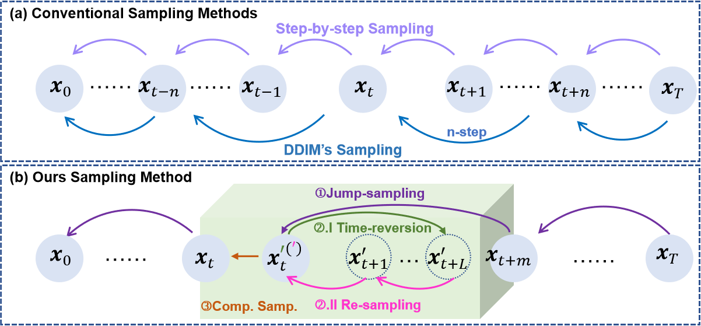
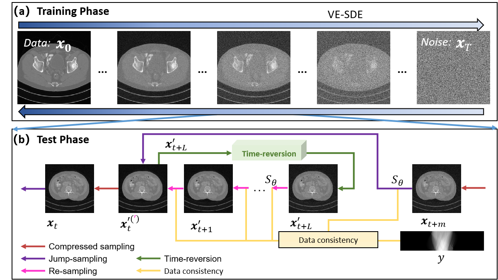

# Time-reversion Fast-sampling Score-based Model for Limited-angle CT Reconstruction

Our paper has been submitted to IEEE Transactions on Medical Imaging  (Reject/Resubmit: major revisions needed and new external review required (12-Nov-2023). 

Our early work has applied for China invention patent for power protection: CN117422784A





Official PyTorch implementation was modified from [this repo](https://github.com/yang-song/score_sde_pytorch).

> **Time-reversion Fast-sampling Score-based Model for Limited-angle CT Reconstruction**<br>
>**Abstract**: <br>
>\red{The score-based generative model (SGM) has received significant attention in the field of medical imaging, particularly in the context of limited-angle computed tomography (LACT).} Traditional SGM approaches achieved robust reconstruction performance \red{by incorporating} a substantial number of sampling steps (such as 2000 steps) during the inference phase. However, these established SGM-based methods require several tens of minutes to reconstruct one slice, which limits its practicality. The \red{main} challenge lies in achieving high-quality images with rapid sampling while preserving sharp edges and small features. \red{In this study, we propose an innovative rapid-sampling strategy for SGM, which we have aptly named the time-reversion fast-sampling (TIFA) score-based model for LACT reconstruction.} The entire sampling procedure adheres steadfastly to the principles of robust optimization theory and is firmly grounded in a comprehensive mathematical model. TIFA's rapid-sampling mechanism comprises several essential components, including jump sampling, time-reversion with re-sampling, and compressed sampling. In the initial jump sampling stage, multiple sampling steps are bypassed to expedite the attainment of preliminary results. Subsequently, during the time-reversion process, the initial results undergo controlled corruption via the introduction of small-scale noise. The re-sampling process then diligently refines the initially corrupted results with a re-sampling technique. Finally, compressed sampling fine-tunes the refinement outcomes by imposing regularization term. Quantitative and qualitative assessments conducted on numerical simulations, real physical phantom, and clinical cardiac datasets, unequivocally demonstrate that TIFA method (using 200 steps) outperforms other state-of-the-art methods (using 2000 steps) from available [0°, 90°] and [0°, 60°]. Furthermore, experimental results underscore that our TIFA method continues to reconstruct high-quality images even with 10 steps.

## Installation

```bash
source install.sh
```

## Train
Above installation script will handle downloading model weights, and installing dependencies. https://github.com/HJ-harry/DiffusionMBIR

## Inference
We provide a variety of comparison methods and inference codes for ablation experiments.

python motion_lim.py

You can choose between different solver implementations

## In the future
More detailed instructions will be provided after the article is received. Due to the short time, please understand if there are any inadequacies. Please contact the correspondence section of the article at wuweiw7@mail.sysu.edu.cn.


